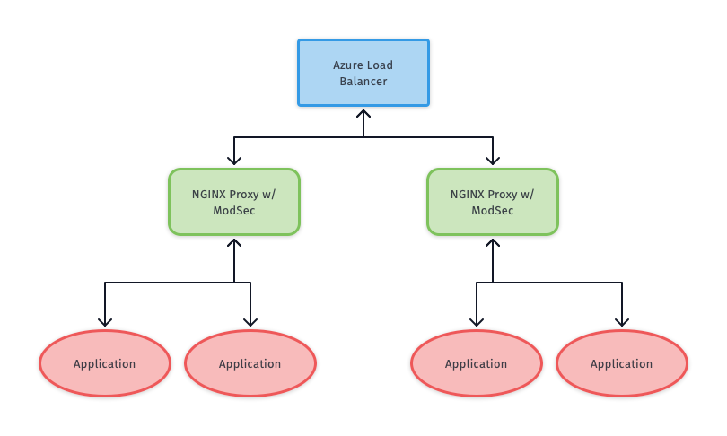

# terraform-azure-nginx-scca

Deploys NGINX on UbuntuProFIPS in Azure as a Reverse Proxy with ModSecurity ([ModSecurity OWASP Core Rule Set](https://github.com/coreruleset/coreruleset)) and NGINX App Server.

* ?testparam=test left in configs to verify.



All settings in variables.tf.

```bash
terraform init
terraform plan
terraform apply -auto-approve
```

## To do

* remove extra variables and collapse variables for each module
* remove extraneous objects
* add more app servers
* containerize everything, everywhere
* Testing Ubuntu PRO FIPS on Proxy devices, currently breaks compiling...
